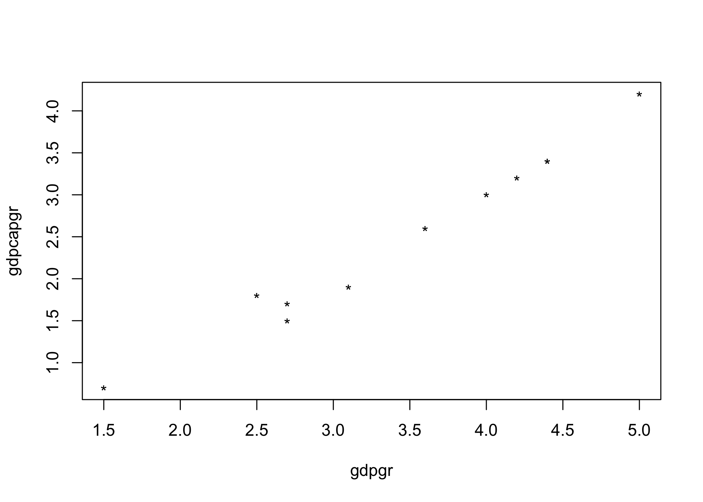
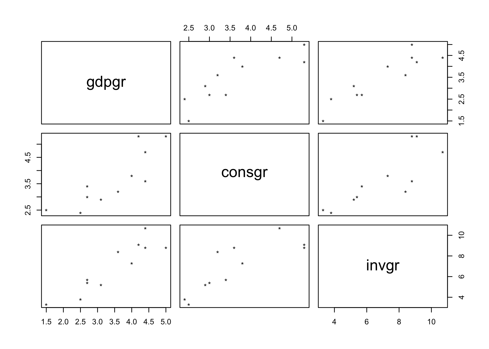
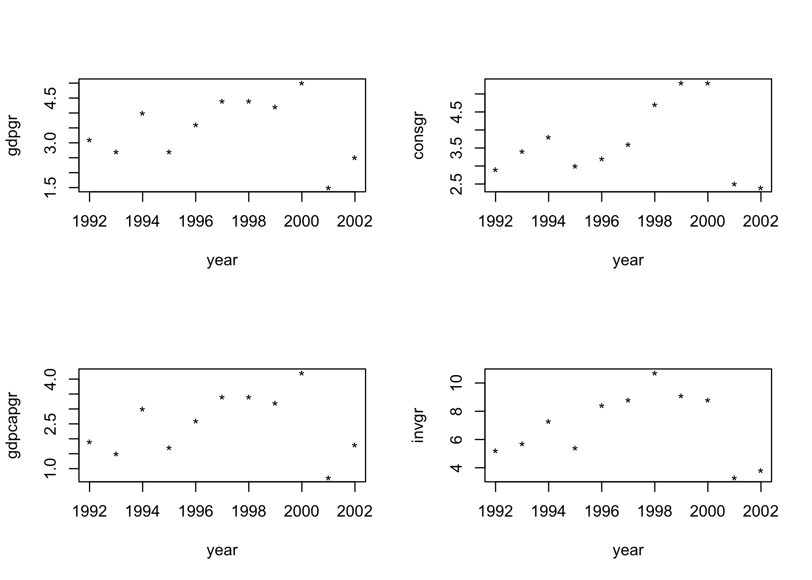
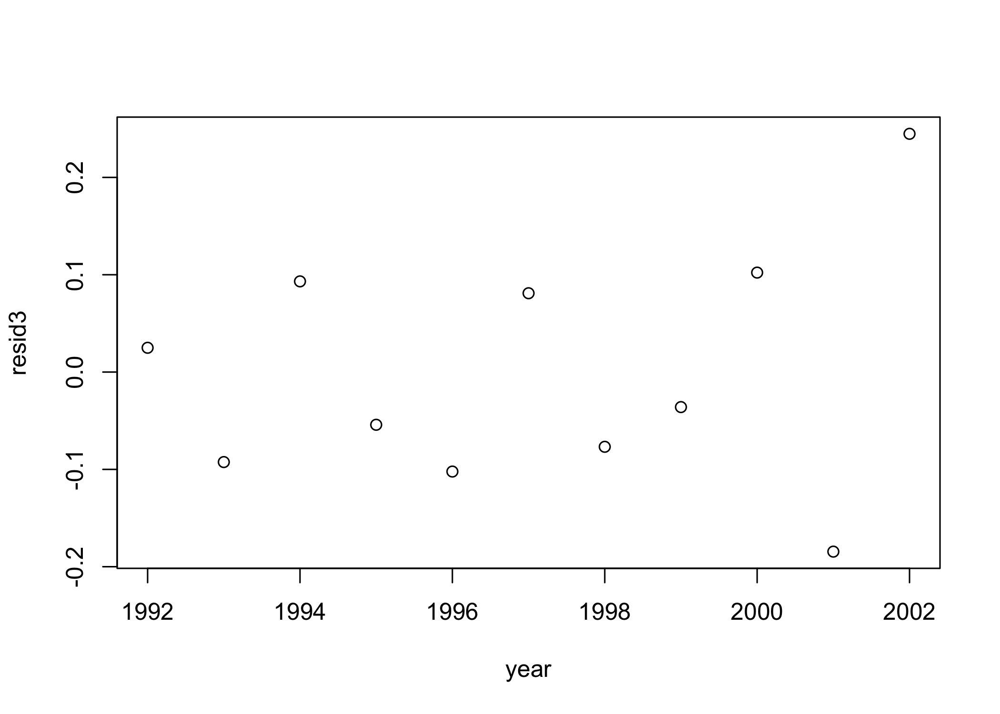
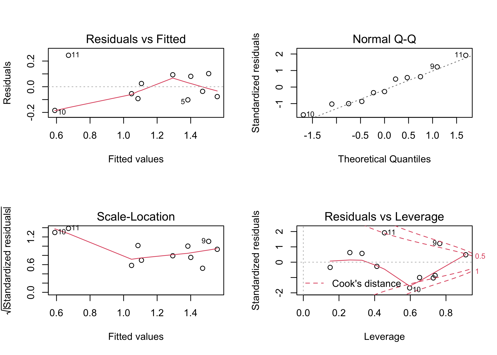

Welcome to e-Tutorial, your on-line help to ECON 4676. The present issue focuses on the basic operations of `R`. The core material was extracted from e-TA's at [Econ 508 of the University of Illinois](http://www.econ.uiuc.edu/~econ508/e-ta.html), and the book "A first course in statistical programming with R" by W. John Braun, Duncan J. Murdoch. . The usual disclaimers apply. [^fn-1] 


[^fn-1]: If you have comments, suggestions, etc. please submit a pull request ;).

# What's R and why use it?

R is a free, open-source, and object oriented language. Free and open-source means that anyone is free to use, redistribute and change the software in any way. Moreover, "R is "GNU S", a freely available language and environment for statistical computing and graphics which provides a wide variety of statistical and graphical techniques" (<http://cran.r-project.org>)

There are lot of software out there to do data analysis that are prettier and seem easier than R, so why should I invest learning R. First, of all R is an investment, not a waste of time. There are three characteristics of R that make it worthwhile learning it. First of all, it is free. Many fancier looking software used today are quite expensive, but R is free and is going to be free always. R also is a language, which means is that you don't only get to use the functions that are build in the software but you can create your own (just to get an overview of the power of the R language  you can take a look Professor [Koenker's Quantile Regression](<http://cran.r-project.org/web/packages/quantreg/index.html>) package). The last reason is that R is extremely well supported. If you have a question you just can [google](<http://www.google.com>) it, post it to [StackOverflow](<http://stackoverflow.com/>) or use [R-blogger](<http://www.r-bloggers.com/>). If you are not convinced yet, just can type "why use the R language"" in Google and I think the results will speak by themselves.

# Downloading and Installing R 
You can obtain a free copy of R CRAN (Comprehensive R Archive Network) on the web, by clicking  <http://cran.r-project.org> and choosing your appropriate operating system.


## The R Interface
After downloading R you can work at least in two ways with R, by using the graphical interface or working in *batch* mode. Since this is an introductory material to R and you are reading it, it is very likely that you will be using a graphical interface, so we'll center the e-TA's around that. After you have mastered the art of scripting in R or if you are brave enough you can try running your scripts in R batch mode.


When using R interactively, or also with scripts, you can use the graphical user interface (GUI). There are at least two options to work this way with R. The first option comes straight out of the standard R installation. You can get access to it by clicking in the R icon installed in your computer. 
The second option is to use [R Studio](<http://www.rstudio.com/>), which is also free and open sourced.
Everything covered in the e-TA's can be done using either one of this GUI's.

#First steps in R
Having installed R the next step is learning the *syntax* of the language, this means learning the rules of it.
After you open R GUI or R Studio you are going to see the R console, which displays the results of your analysis or any messages associated with your code that is entered in the command line (after the arrow ">"). 

For example, we can use R as a calculator. You can type arithmetical expressions at the prompt (">"):


```r
    2 + 2
```

```
[1] 4
```

or


```r
    log(1)
```

```
[1] 0
```

The [1] indicates that it is the first result from the command, and in this case the only one. You can also type something  with multiple values for example a sequence of integers from 10 to 40: 
 
 

```r
    10:40
```

```
 [1] 10 11 12 13 14 15 16 17 18 19 20 21 22 23 24 25 26 27 28 29 30 31 32 33 34
[26] 35 36 37 38 39 40
```

The first line starts with the first return value, so is labeled [1]; the second line starts with the 24th, so is labeled [24].


To quit you session just type


```r
    q()
```


## Scripting your work
Rather than saving the work space, it is highly recommended that you keep a record of the commands entered, so that we can reproduce it at a later date. The easiest way to do this is to enter commands in R'??s script editor, available from the File menu. Commands are executed by highlighting them and hitting Ctrl-R. At the end of a session, save the final script for a permanent record of your work. You can also use any text editor to do so. 
In R Studio the script editor opens next to the console and the mechanics is the same. Commands are executed by highlighting them and hitting Ctrl-Enter.

A *script* is a text file that contains lines of R code that can be saved and use over and over again. This is the preferred method to save your work and guarantee reproducibility. To know more on reproducible research you should read Professor Koenker's [Reproducibility in Econometrics Research webpage](<http://www.econ.illinois.edu/~roger/repro.html>)

A useful tip to keep in mind is that everything that is written after a # sign is assumed to be a comment and is ignored by `R`.

## Assignment

R has a work space known as `global enviroment` where you can store your objects. For example, suppose we would like to store the calculation `log(2)` for future use. To do this type:
 

```r
    x <- log(2)
```


Now `x` holds the result of such operation. To see this type
    

```r
    x
```

```
[1] 0.6931472
```

Now we can use `x` to do any operations. For example


```r
    x+x
```

```
[1] 1.386294
```

```r
    x*x
```

```
[1] 0.480453
```

#Vectors

You can also enter vectors. The `c()` function creates a vector. For example:


```r
    weight <- c(65,45,67,78,56)
```

Creates a vector containing the numbers 65, 45, 67, 78 and 56. We can see the contented by typing


```r
    weight
```

```
[1] 65 45 67 78 56
```

You can also check the length of the vector


```r
   length(weight)
```

```
[1] 5
```

It is possible to do some arithmetic computations, for example multiply all elements by 3


```r
    weight*3
```

```
[1] 195 135 201 234 168
```

or calculate a simple formula like


```r
    height <- c(1.7,1.8,1.76,1.65,1.74)

    bmi <- weight/height^2

    bmi
```

```
[1] 22.49135 13.88889 21.62965 28.65014 18.49650
```

First that we created a new vector that contains heights, and then calculated the body mass index. Note that the division is done member wise.


# Matrices and Arrays

To arrange numbers in a matrix, we can use the matrix function


```r
    x<-matrix(1:12,nrow=3, ncol=4)
    x
```

```
     [,1] [,2] [,3] [,4]
[1,]    1    4    7   10
[2,]    2    5    8   11
[3,]    3    6    9   12
```

or we can create a sequence of numbers and assign dimensions to it


```r
    x <- 1:12
    x
```

```
 [1]  1  2  3  4  5  6  7  8  9 10 11 12
```

```r
    dim(x) <- c(3,4)
    x
```

```
     [,1] [,2] [,3] [,4]
[1,]    1    4    7   10
[2,]    2    5    8   11
[3,]    3    6    9   12
```

We can assign names to the rows. For example, we assign the three first letters


```r
    rownames(x) <- LETTERS[1:3]
    x
```

```
  [,1] [,2] [,3] [,4]
A    1    4    7   10
B    2    5    8   11
C    3    6    9   12
```

Another useful operations are: 


|Operator or Function| Description                                                           |
|:------------------:|-----------------------------------------------------------------------|
|`A * B`               | Element-wise multiplication                                           |
|`A %*% B`             | Matrix multiplication                                                 |
|`A %o% B`             | Outer product. AB'                                                    |
|`t(A)`                |  Transpose                                                            |
|`diag(x)`             | Creates diagonal matrix with elements of x in the principal diagonal  |
|`solve(A, b)`         | Returns vector x in the equation b = Ax (i.e., A-1b)                  |
|`solve(A)`            | Inverse of A where A is a square matrix.                              |
|`cbind(A,B,...)`      | Combine matrices(vectors) horizontally. Returns a matrix.             |
|`rbind(A,B,...)`      | Combine matrices(vectors) vertically. Returns a matrix.               |
|`rowMeans(A)`         | Returns vector of row means.                                          |
|`rowSums(A)`          | Returns vector of row sums.                                           |
|`colMeans(A)`         | Returns vector of column means.                                       |  
|`colSums(A)`          | Returns vector of column means.                                        | 

(taken from [Quick-R](<http://www.statmethods.net/advstats/matrix.html>))


# Indexing

Individual elements of an array can be referenced by the name of the array followed by the subscripts in square brackets, and separated by commas. For example:

```r
    x<-matrix(1:12,nrow=3,ncol=4)
    x[,1]
```

```
[1] 1 2 3
```
refers to the first column of x. 

```r
    x[1,]
```

```
[1]  1  4  7 10
```
and refers to the first row. If we type

```r
    x[,1:2]
```

```
     [,1] [,2]
[1,]    1    4
[2,]    2    5
[3,]    3    6
```
we get the first two columns of x. But if we type

```r
    x[,c(2,4)]
```

```
     [,1] [,2]
[1,]    4   10
[2,]    5   11
[3,]    6   12
```
we obtain the second and forth column of x. We can also subset using another vector, for example:

```r
    weight[height>1.7]
```

```
[1] 45 67 56
```
gets those elements in weight that have a corresponding element in height bigger than 1.7
  
____

# Working in R

One way to learn R is to dive right in and work through a simple example.

## Example - The U.S. Economy in the 1990s

Let's start with an analysis of the performance of the U.S. economy during the 1990s. We have annual data on GDP growth, GDP per capita growth, private consumption growth, investment growth, manufacturing labor productivity growth, unemployment rate, and inflation rate. (The data is publicly available in the statistical appendixes of the World Economic Outlook, May 2001, IMF).

The first step is to tell R where is your working directory. This means telling R where are all the files related to your project. You should do this always at the beginning of your R session. You do so by using the `setwd(path)` function. Where path is the path to the folder where you want to write and read things. For example


```r
    # setwd("C:/ECON4676/eTA/")
```
you should note that first that I'm using the forward slash. You could also use backslash but in that case you should use double backslash (\\). Note that if you are using MAC you should omit "C:"
This command line is telling R to write and read everything in the ECON4676/eTA folder (that I assume you created before hand)

The next step is to download the data. Let's explore two ways of doing so. The first one is the "traditional" way. Go to the web page containing the data, and save it. The data is available [here](https://github.com/ECON-4676-UNIANDES/e-TA/blob/master/e-ta2_R/Data/US90.txt).
The other way to do it, is to use an R function:
  

```r
    download.file("https://github.com/ECON-4676-UNIANDES-Fall-2021/e-TA/blob/master/e-ta2_R/Data/", "US90.txt")
```

The first argument of the `download.file` function is the url where the file is located, whereas the second argument is the name where the downloaded file is saved. To know more about this function you can type in your console `?download.file`, that will take you to the function's help file.

Now, we need to load the *.txt* file to R. To do so we use the `read.table` function.


```r
    US90<-read.table("data/US90.txt", sep="", header=TRUE)
```
What this function does is read the US90.txt file, names the data set as "US90" and tells R that the variables are separated by a blank space (`sep=""`) and that the first column is the header. Obviously remembering all the arguments that a specific function can take is ludicrous, by doing `?read.table` or `help(read.table)`  you can see all the options that the function can take.

Now you have an object called data frame that contains your data, to check what class is an object you can type class(<name of the object>), i.e. 

```r
    class(US90) 
```

```
[1] "data.frame"
```

Data frames are just matrices that contains different types of data, not only numbers as we are used to. Since it is a matrix you can check it's dimension by typing 


```r
    dim(US90)
```

```
[1] 11  8
```

Now you are ready to work with your data!!

### Basic Operations

A first thing you can do is extract each variable from the data frame to single vectors. To make the individual analysis simpler. To do so you extract them from the data frame and give them respective names.
 

```r
    year<-US90$year
    gdpgr<-US90$gdpgr
    consgr<-US90$consgr
    invgr<-US90$invgr
    unemp<-US90$unemp
    gdpcapgr<-US90$gdpcapgr
    inf<-US90$inf   
    producgr<-US90$producgr
```

Now we have created 8 objects, vectors each containing a variable.
As an alternative you could `attach()` your data frame to the R search path. This will make objects within data frames easier to access. However, the attach function does not play nice with variables in the local work space with the same names. So it is advisable to avoid using it.

A useful way to explore your data is checking the main statistics of each variable. 


```r
    summary(US90)
```

```
      year          gdpgr           consgr          invgr       
 Min.   :1992   Min.   :1.500   Min.   :2.400   Min.   : 3.300  
 1st Qu.:1994   1st Qu.:2.700   1st Qu.:2.950   1st Qu.: 5.300  
 Median :1997   Median :3.600   Median :3.400   Median : 7.300  
 Mean   :1997   Mean   :3.464   Mean   :3.645   Mean   : 6.955  
 3rd Qu.:2000   3rd Qu.:4.300   3rd Qu.:4.250   3rd Qu.: 8.800  
 Max.   :2002   Max.   :5.000   Max.   :5.300   Max.   :10.700  
     unemp          gdpcapgr          inf           producgr    
 Min.   :4.000   Min.   :0.700   Min.   :1.500   Min.   :1.900  
 1st Qu.:4.450   1st Qu.:1.750   1st Qu.:2.250   1st Qu.:3.200  
 Median :5.000   Median :2.600   Median :2.600   Median :3.900  
 Mean   :5.327   Mean   :2.491   Mean   :2.591   Mean   :4.309  
 3rd Qu.:5.850   3rd Qu.:3.300   3rd Qu.:2.950   3rd Qu.:5.450  
 Max.   :7.500   Max.   :4.200   Max.   :3.400   Max.   :7.200  
```

Which gives you the minimum, 1st quartile, median, 3rd quartile, and maximum of each variable. If you also wish to know the standard deviation of a single variable, just include its name after the command


```r
    summary(gdpgr)
```

```
   Min. 1st Qu.  Median    Mean 3rd Qu.    Max. 
  1.500   2.700   3.600   3.464   4.300   5.000 
```

```r
    sd(gdpgr)
```

```
[1] 1.050974
```

If you are in interested only in subset of your data, you can inspect it using filters. For example, begin by checking the dimension of the data matrix:


```r
    dim(US90)
```

```
[1] 11  8
```

This means that your data matrix contains 11 rows (corresponding to the years 1992 to 2002) and 8 columns (corresponding to the variables). If you are only interested in a subset of the time periods (e.g., the years of the Clinton administration), you can select it as a new object:


```r
    Clinton<-US90[2:9, ]
```

and then compute its main statistics:


```r
    summary(Clinton)
```

```
      year          gdpgr           consgr          invgr       
 Min.   :1993   Min.   :2.700   Min.   :3.000   Min.   : 5.400  
 1st Qu.:1995   1st Qu.:3.375   1st Qu.:3.350   1st Qu.: 6.900  
 Median :1996   Median :4.100   Median :3.700   Median : 8.600  
 Mean   :1996   Mean   :3.875   Mean   :4.037   Mean   : 8.025  
 3rd Qu.:1998   3rd Qu.:4.400   3rd Qu.:4.850   3rd Qu.: 8.875  
 Max.   :2000   Max.   :5.000   Max.   :5.300   Max.   :10.700  
     unemp          gdpcapgr          inf           producgr   
 Min.   :4.000   Min.   :1.500   Min.   :1.500   Min.   :1.90  
 1st Qu.:4.425   1st Qu.:2.375   1st Qu.:2.275   1st Qu.:3.30  
 Median :5.200   Median :3.100   Median :2.700   Median :3.85  
 Mean   :5.213   Mean   :2.875   Mean   :2.587   Mean   :4.40  
 3rd Qu.:5.725   3rd Qu.:3.400   3rd Qu.:2.925   3rd Qu.:5.90  
 Max.   :6.900   Max.   :4.200   Max.   :3.400   Max.   :7.20  
```

If you are only interested in a subset of the variables (e.g., consumption and investment growth rates), you can select them by typing:


```r
    VarSet1<-US90[ ,3:4]
```

and then compute its main statistics:


```r
    summary(VarSet1)
```

```
     consgr          invgr       
 Min.   :2.400   Min.   : 3.300  
 1st Qu.:2.950   1st Qu.: 5.300  
 Median :3.400   Median : 7.300  
 Mean   :3.645   Mean   : 6.955  
 3rd Qu.:4.250   3rd Qu.: 8.800  
 Max.   :5.300   Max.   :10.700  
```

or in a much simpler way:


```r
    summary(US90[,3:4])
```

```
     consgr          invgr       
 Min.   :2.400   Min.   : 3.300  
 1st Qu.:2.950   1st Qu.: 5.300  
 Median :3.400   Median : 7.300  
 Mean   :3.645   Mean   : 6.955  
 3rd Qu.:4.250   3rd Qu.: 8.800  
 Max.   :5.300   Max.   :10.700  
```

To create new variables, you can use traditional operators (+,-,*,/,^) and name new variables as follows:

* add or subtract:   `lagyear<-year-1`
* multiply:       `newgdpgr<-gdpgr*100`
* divide:         `newunemp<-unemp/100`
* exponential:    `gdpcap2<-gdpcapgr^2`
* square root:      `sqrtcons<-sqrt(consgr)`
* natural logs:     `loginv<-log(invgr)`
* base 10 logs:     `log10inf<-log10(inf)`
* exponential:    `expprod<-exp(producgr)`

 

###Exploring Graphical Resources

Suppose now you want to check the relationship among variables. For example, suppose you would like to see how much GDP growth is related with GDP per capita growth. This corresponds to a single graph that could be obtained as follows:


```r
    plot(gdpgr, gdpcapgr, pch="*")
```

<!-- -->

Another useful tool is the check on multiple graphs in a single window. For example, suppose you would like to expand your selection, and  check the pair wise relationship of GDP, Consumption, and Investment Growth. You can obtain that as follows:


```r
    pairs(US90 [, 2:4], pch="*")
```

<!-- -->


Suppose you would like to see the performance of multiple variables (e.g., GDP, GDP per capita, Consumption, and Investment growth rates) along time. The simplest way is as follows:


```r
    par(mfrow=c(2,2))
    plot(year, gdpgr,    pch="*")
    plot(year, consgr,   pch="*")
    plot(year, gdpcapgr, pch="*")
    plot(year, invgr,    pch="*")
```

<!-- -->

Here the function `par(mfrow=c(2,2))` creates a matrix with 2 rows and 2 columns in which the individual graphs will be stored, while `plot` is in charge of producing individual graphs for each selected variable. 

You can easily expand the list of variables to obtain a graphical assessment of the performance of each of them along time. You can also use the graphs to assess cross-correlations (in a pair wise sense) among variables.
 
 

###Linear Regression

Before running a regression, it is recommended you check the cross-correlations among covariates. You can do that graphically (see above) or using the following simple command:


```r
    cor(US90)
```

```
                year       gdpgr     consgr       invgr      unemp   gdpcapgr
year      1.00000000 -0.02868877  0.1311224 -0.03003992 -0.8708412  0.1064203
gdpgr    -0.02868877  1.00000000  0.8393692  0.90974640 -0.3034902  0.9890287
consgr    0.13112235  0.83936925  1.0000000  0.82695132 -0.4761100  0.8347306
invgr    -0.03003992  0.90974640  0.8269513  1.00000000 -0.3684201  0.8841040
unemp    -0.87084123 -0.30349017 -0.4761100 -0.36842005  1.0000000 -0.4143217
gdpcapgr  0.10642030  0.98902873  0.8347306  0.88410398 -0.4143217  1.0000000
inf      -0.33598498 -0.10120944 -0.1198435 -0.30902448  0.3590237 -0.1229620
producgr  0.33166789  0.57079980  0.7049924  0.52383121 -0.5336310  0.6002807
                 inf    producgr
year     -0.33598498  0.33166789
gdpgr    -0.10120944  0.57079980
consgr   -0.11984349  0.70499242
invgr    -0.30902448  0.52383121
unemp     0.35902370 -0.53363102
gdpcapgr -0.12296202  0.60028067
inf       1.00000000 -0.08321976
producgr -0.08321976  1.00000000
```

From the matrix above you can see, for example, that GDP and GDP per capita growth rates are closely related, but each of them has a different degree of connection with unemployment rates (in fact, GDP per capita presents higher correlation with unemployment rates than total GDP). Inflation and unemployment present a reasonable degree of positive correlation (about 36%).

Now you start with simple linear regressions. For example, let's check the regression of GDP versus investment growth rates. You just type:


```r
    model1<-lm(gdpgr~invgr)
    summary(model1)
```

```

Call:
lm(formula = gdpgr ~ invgr)

Residuals:
    Min      1Q  Median      3Q     Max 
-0.5503 -0.3515 -0.1152  0.3106  0.8039 

Coefficients:
            Estimate Std. Error t value Pr(>|t|)    
(Intercept)  0.70328    0.44220   1.590 0.146208    
invgr        0.39691    0.06038   6.574 0.000102 ***
---
Signif. codes:  0 '***' 0.001 '**' 0.01 '*' 0.05 '.' 0.1 ' ' 1

Residual standard error: 0.4599 on 9 degrees of freedom
Multiple R-squared:  0.8276,	Adjusted R-squared:  0.8085 
F-statistic: 43.22 on 1 and 9 DF,  p-value: 0.0001023
```

Please note that you don't need to include the intercept, because R automatically includes it. In the output above you have the main regression diagnostics (F-test, adjusted R-squared, t-statistics, sample size, etc.). The same rule apply to multiple linear regressions. For example, suppose you want to find the main sources of GDP growth. The command is:


```r
    model2<-lm(gdpgr~consgr+invgr+producgr+unemp+inf)
    summary(model2)
```

```

Call:
lm(formula = gdpgr ~ consgr + invgr + producgr + unemp + inf)

Residuals:
       1        2        3        4        5        6        7        8 
 0.09515 -0.37843  0.40786 -0.16802 -0.33377  0.43903 -0.26519 -0.19791 
       9       10       11 
 0.28562 -0.43586  0.55152 

Coefficients:
            Estimate Std. Error t value Pr(>|t|)  
(Intercept) -0.88659    1.49293  -0.594   0.5785  
consgr       0.18221    0.36052   0.505   0.6348  
invgr        0.34489    0.13380   2.578   0.0496 *
producgr     0.04902    0.15473   0.317   0.7642  
unemp        0.05517    0.18980   0.291   0.7830  
inf          0.30196    0.37260   0.810   0.4545  
---
Signif. codes:  0 '***' 0.001 '**' 0.01 '*' 0.05 '.' 0.1 ' ' 1

Residual standard error: 0.517 on 5 degrees of freedom
Multiple R-squared:  0.879,	Adjusted R-squared:  0.7581 
F-statistic: 7.266 on 5 and 5 DF,  p-value: 0.02415
```

In the example above, despite we have a high adjusted R-squared, most of the covariates are not significant at 5% level (actually, only investment is significant in this context). There may be many problems in the regression above. During the ECON4676 classes, you will learn how to solve those problems, and how to select the best specification for your model.

You can also run log-linear regressions. To do so, you type:

```r
    model3<-lm(log(gdpgr)~log(consgr)+log(invgr)+log(producgr)+log(unemp)+log(inf))
    summary(model3)
```

```

Call:
lm(formula = log(gdpgr) ~ log(consgr) + log(invgr) + log(producgr) + 
    log(unemp) + log(inf))

Residuals:
       1        2        3        4        5        6        7        8 
 0.02495 -0.09248  0.09318 -0.05416 -0.10222  0.08100 -0.07679 -0.03598 
       9       10       11 
 0.10220 -0.18450  0.24480 

Coefficients:
              Estimate Std. Error t value Pr(>|t|)  
(Intercept)   -0.99125    0.78758  -1.259   0.2637  
log(consgr)    0.11488    0.46669   0.246   0.8153  
log(invgr)     0.77976    0.30812   2.531   0.0525 .
log(producgr)  0.09503    0.19355   0.491   0.6442  
log(unemp)     0.20093    0.37167   0.541   0.6120  
log(inf)       0.11846    0.27854   0.425   0.6883  
---
Signif. codes:  0 '***' 0.001 '**' 0.01 '*' 0.05 '.' 0.1 ' ' 1

Residual standard error: 0.1729 on 5 degrees of freedom
Multiple R-squared:  0.8779,	Adjusted R-squared:  0.7559 
F-statistic: 7.193 on 5 and 5 DF,  p-value: 0.02466
```

Finally, you can plot the vector of residuals as follows:

```r
    resid3<-resid(model3)
    plot(year,resid3)
```

<!-- -->


You can also obtain the fitted values and different plots as follows:

```r
    fit3<-fitted(model3)  #   This will generate a vector of fitted values for the model 3.
    par(mfrow=c(2,2))
    plot(model3)      #     This will generate default plots of residuals vs. fitted values, Normal  Q-Q, scale-location, and Cook's distance.
```

<!-- -->

Note here that we have added inline comments using the # symbol 

### Linear Hypothesis Testing

Suppose you want to check whether the variables investment, consumption, and productivity growth matter to GDP growth. In this context, you want to test if those variables matter simultaneously. The best way to check that in R is as follows. First, run a unrestricted model with all variables:


```r
    u<-lm(log(gdpgr)~log(invgr)+log(consgr)+log(producgr)+log(unemp)+log(inf))
```

Then run a restricted model, discarding the variables under test:

```r
r<-lm(log(gdpgr)~log(unemp)+log(inf))
```

Now you will run a F-test comparing the unrestricted to the restricted model. To do that, you will need to write the F-test function in R, as follows:  (The theory comes from Johston and DiNardo (1997), p. 95, while the R code is a version of Greg Kordas' S code adjusted for this specific problem.)
 

```r
    F.test<-function(u,r){
        #u is the unrestricted model
        k<-length(coef(u))
        n<-length(resid(u))
        eeu<-sum(resid(u)^2)
        #r is the restricted model
        kr<-length(coef(r))
        eer<-sum(resid(r)^2)
        #q is the number of restrictions
        q<-k-kr
        #F-statistic
        Fstat<-((eer-eeu)/q)/(eeu/(n-k))
        #P-value
        Fprob<-1-pf(Fstat, q, n-k)
        list(Fstat=Fstat, Fprob=Fprob)
}
```

After that, you can run the test and obtain the F-statistic and p-value:


```r
    F.test(u,r)$Fstat
```

```
[1] 11.40259
```

```r
    F.test(u,r)$Fprob
```

```
[1] 0.01127813
```


And the conclusion is that you can reject the null hypothesis of joint non-significance at 1.13% level.
 

### Creating your own functions in R
As we mentioned previously one of the strengths of R is that you can create your own functions. Actually many of the functions in R are just functions of functions.  
The basic structure of a function is

One of the great strengths of R is the user's ability to add functions. In fact, many of the functions in R are actually functions of functions. The structure of a function is given below.


```r
    myfunction <- function(arg1, arg2, ...){
        statements
        return(object)
    }
```

You already created a function for the F-test in the above example, let's try to create another one. For example obtaining the coefficients of a linear regression:


```r
    lr <- function(y,X){
        X<-data.matrix(X)
        y<-data.matrix(y)
        Intercept<-rep(1,dim(X)[1])
        X<-cbind(Intercept,X)
        b<-solve(t(X)%*%X)%*%t(X)%*%y
        b
    }
```
The `lr()` function returns the coefficients of a OLS regression by calculating:

$$\hat{\beta}=(X'X)^{-1}X'y$$

you can check that the function actually returns the same values as the `lm()` function.


```r
    lr(US90[,2],US90[,c(3,4,5)])
```

```
                 [,1]
Intercept -0.31475783
consgr     0.33600053
invgr      0.29399791
unemp      0.09552687
```

```r
    summary(lm(gdpgr~consgr+invgr+unemp))$coef
```

```
               Estimate Std. Error    t value   Pr(>|t|)
(Intercept) -0.31475783  1.2148675 -0.2590882 0.80302106
consgr       0.33600053  0.2707282  1.2410991 0.25454513
invgr        0.29399791  0.1100050  2.6725870 0.03187991
unemp        0.09552687  0.1505735  0.6344201 0.54597347
```


Another nice thing about R is that you can create your own function and create a loop. For example, 


```r
    download<-function(x,folder){
        URL<- paste("https://github.com/ECON-4676-UNIANDES-Fall-2021/e-TA/blob/master/e-ta2_R/Data/",folder,x,sep='/')
       destfile <- paste(folder, x, sep='/')
       download.file(URL,destfile)    
    }
```


I create a function that downloads a file from the ECON4676 webpage and saves it in a desired folder


```r
    names<-list("US90.txt", "giffen.csv") 
```

Next I created a list with the name of the files I want to download, and then run a loop with `lapply' that downloads and saves all this files in my computer in the folder "data"


```r
    lapply(names, download, folder="Data")
```

# Final words

In this first e-TA I tried to convince you why you should use R as well to introduce you to some basic operations. The next e-TA is closely related to the first problem set and hopefully it will help you get the most out of ECON 4676 and R.


